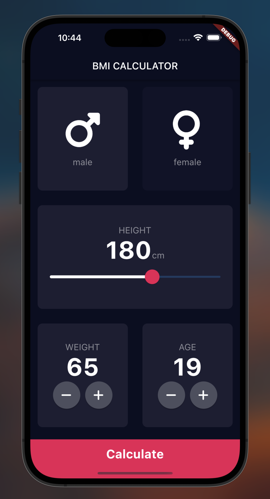
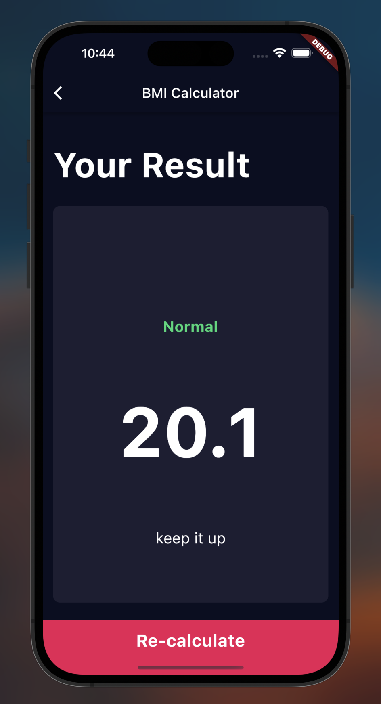

# BMI Calculator

A Body Mass Index Calculator inspired by the beautiful designs made by [Ruben Vaalt].  

In this project I learned:  
- How to use Flutter themes. 
- How to create multi-page apps using Flutter Routes and Navigator.
- How to extract and refactor Flutter Widget. 
- How to pass functions as parameters and fields.
- How to use the GestureDetector Widget.
- How to use custom colour palettes by using hex codes.
- How to customise Flutter Widgets to achieve a specific design style.

  
&nbsp; &nbsp; &nbsp; &nbsp;
  

